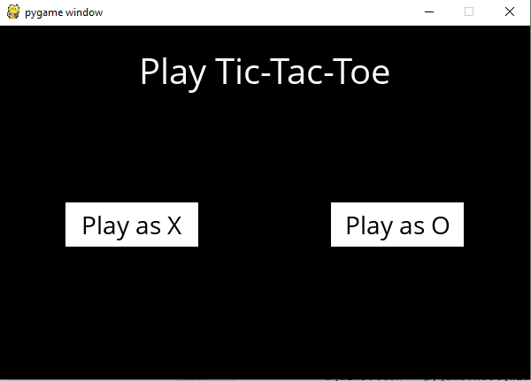
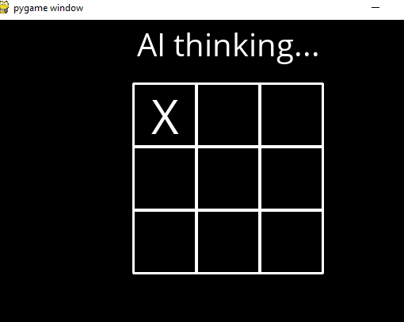
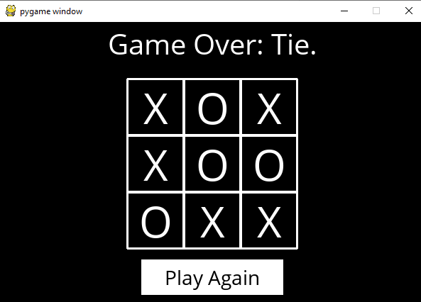

# AI_minimaxalgoritm_tictoctoe_game
Using Minimax algorithm, implement an AI to play Tic-Tac-Toe optimally.

There are two main files in this project: runner.py and tictactoe.py. tictactoe.py contains all of the logic for playing the game, and for making optimal moves. runner.py  contains all of the code to run the graphical interface for the game. This part(runner.py) taken from CS50’s Introduction to Artificial Intelligence with Python Online Course document.

 <h4> You can choose which side you want to play.And the game will be start after that. </h5>

 <h4> In the initial game state, X gets the first move. Subsequently, AI alternates with each additional move.</h5>
 
 
 <h4> One can win the game with three of their moves in a row horizontally, vertically, or diagonally. If nobody wins it will be goes to tie</h5>

